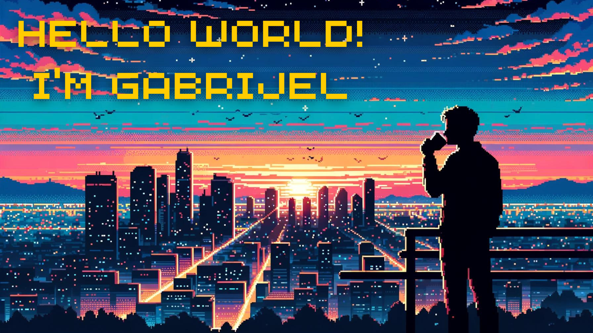

- I'm currently working at [Plume Design, Inc.](https://www.linkedin.com/company/plume-wifi) as a Cloud API Engineer ☁️
- I'm passionate about all things SSO 🔐
- I like to be up to date with awesome new AI technologies 🤖
- Fun fact: I listen to audiobooks 🎧📚 and play games 🕹️ in my spare time 

  
## You can contact me on

## A quote

## My tech stack

## My favorite tools

## When I'm AFK:

